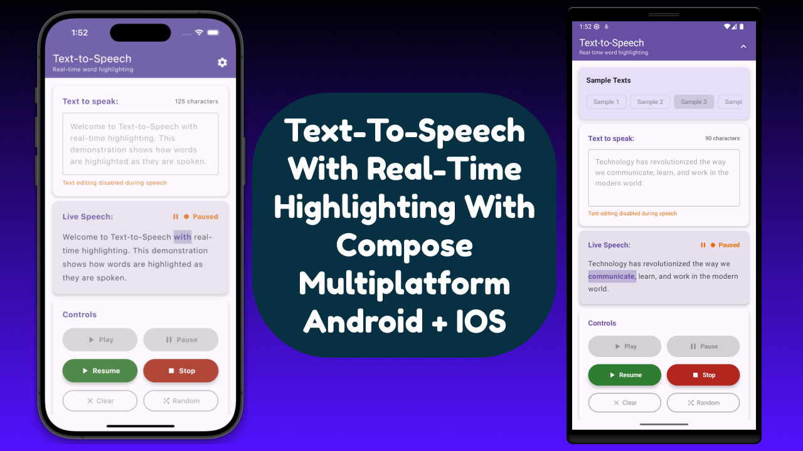

# 🎙️ Text-to-Speech with Real-time Highlighting

A beautiful, cross-platform Text-to-Speech application built with Compose Multiplatform featuring
real-time word highlighting, pause/resume functionality, and seamless Swift-Kotlin interoperability
using modern expect/actual patterns.

https://github.com/user-attachments/assets/3656a3e2-801e-4b7e-85a3-6ac274786336

## ✨ Features

- Real-time Word Highlighting - Words are highlighted as they're spoken
- Pause & Resume - Seamless pause/resume with accurate position tracking
- Cross-platform - Runs on Android and iOS with shared UI
- Custom Text Input - Type your own text or use sample texts
- Multiple Samples - Pre-loaded sample texts for quick testing
- expect/actual Pattern - Clean platform abstractions using Kotlin Multiplatform's expect/actual
  mechanism
- Swift Interoperability - Native Swift UI components called seamlessly from Kotlin side
- Provider Pattern - Elegant abstraction layer for platform-specific implementations
- Unified Interface - Single Kotlin interface for all platforms with platform-specific providers
- Type-Safe Bridging - Compile-time safe Swift-Kotlin communication

### Run the app on your device or emulator:

- For Android, run the `composeApp` module by selecting the `app` configuration. If you need help
  with the
  configuration, follow this link
  for [android](https://www.jetbrains.com/help/kotlin-multiplatform-dev/compose-multiplatform-create-first-app.html#run-your-application-on-android)
- For iOS, run the `composeApp` module by selecting the `iosApp` configuration. If you need help
  with the configuration,
  follow this link for [Ios](https://www.jetbrains.com/help/kotlin-multiplatform-dev/compose-multiplatform-create-first-app.html#run-your-application-on-ios)

## ❤ Show your support

Give a ⭐️ if this project helped you!

Your generosity is greatly appreciated! Thank you for supporting this project.

## Connect with me

## Author

**Meet**
